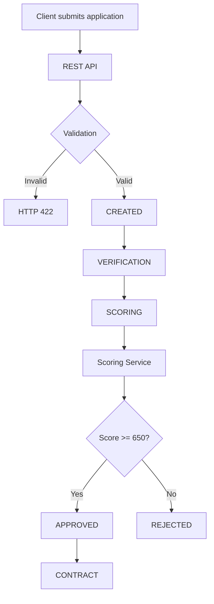
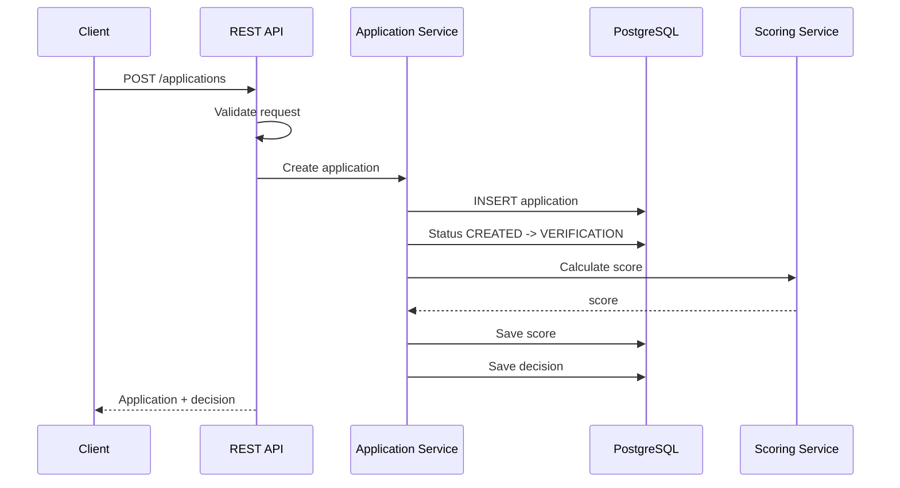
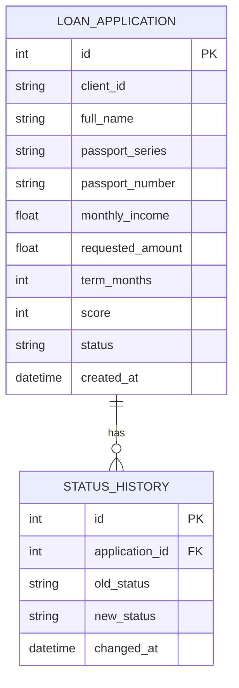

# Diagrams

## BPMN-like process

```mermaid
flowchart TD
    A[Client submits application] --> B[REST API]
    B --> C{Validation}
    C -- Invalid --> X[HTTP 422]
    C -- Valid --> D[CREATED]
    D --> E[VERIFICATION]
    E --> F[SCORING]
    F --> G[Scoring Service]
    G --> H{Score >= 650?}
    H -- Yes --> I[APPROVED]
    H -- No --> J[REJECTED]
    I --> K[CONTRACT]
```

## Sequence diagram

```mermaid
sequenceDiagram
    participant C as Client
    participant API as REST API
    participant S as Application Service
    participant DB as PostgreSQL
    participant SC as Scoring Service

    C->>API: POST /applications
    API->>API: Validate request
    API->>S: Create application
    S->>DB: INSERT application
    S->>DB: Status CREATED -> VERIFICATION
    S->>SC: Calculate score
    SC-->>S: score
    S->>DB: Save score
    S->>DB: Save decision
    API-->>C: Application + decision
```

## ER diagram

```mermaid
erDiagram
    LOAN_APPLICATION ||--o{ STATUS_HISTORY : has

    LOAN_APPLICATION {
        int id PK
        string client_id
        string full_name
        string passport_series
        string passport_number
        float monthly_income
        float requested_amount
        int term_months
        int score
        string status
        datetime created_at
    }

    STATUS_HISTORY {
        int id PK
        int application_id FK
        string old_status
        string new_status
        datetime changed_at
    }
```
